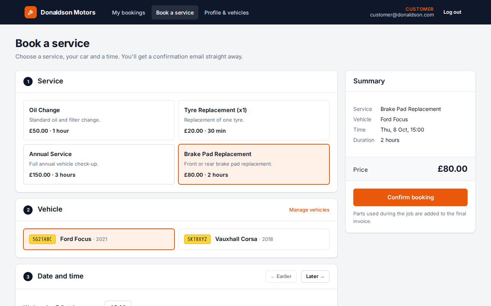
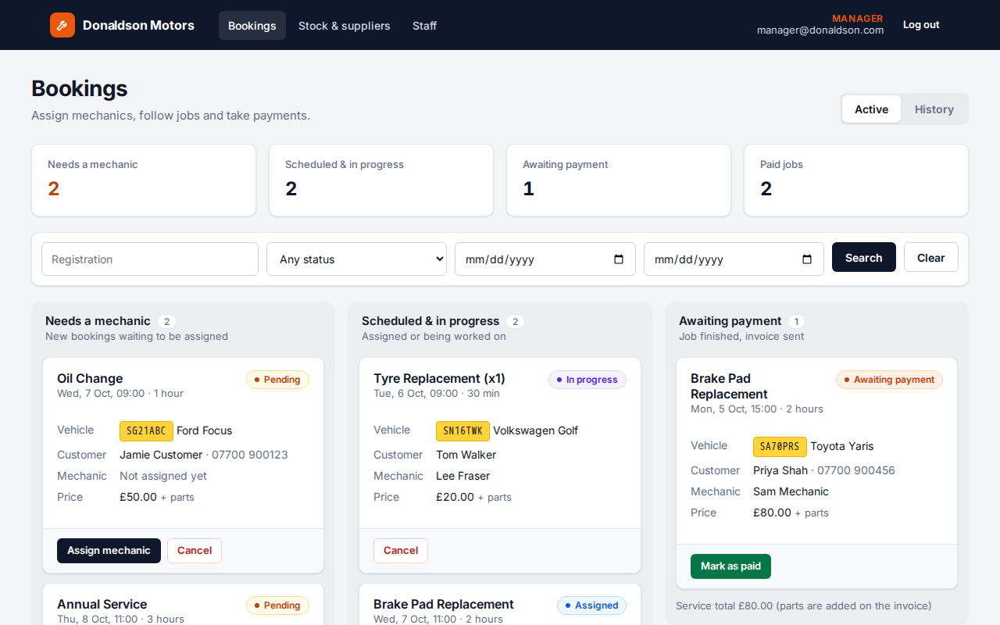
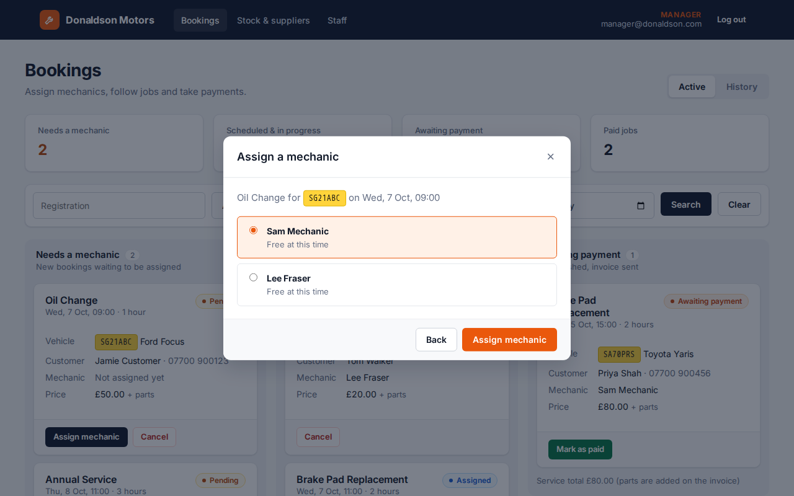
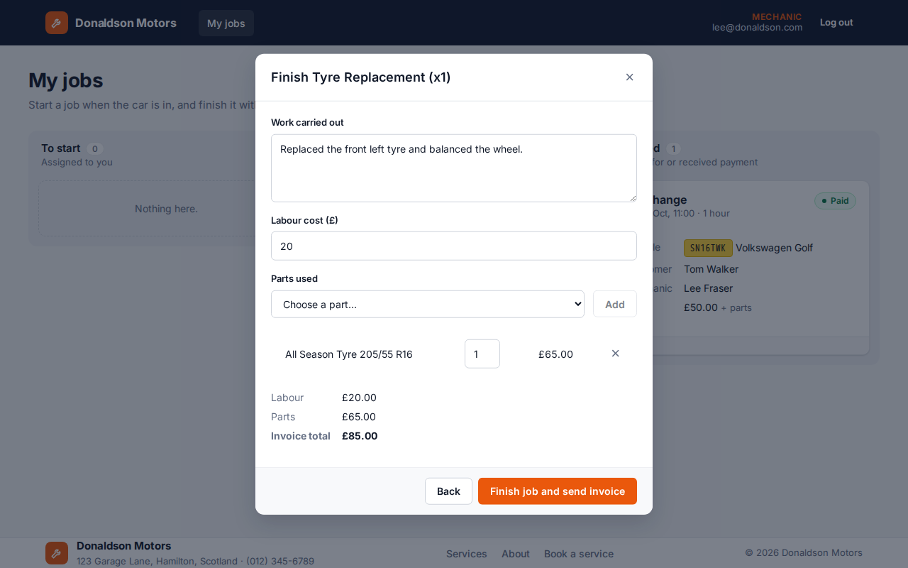
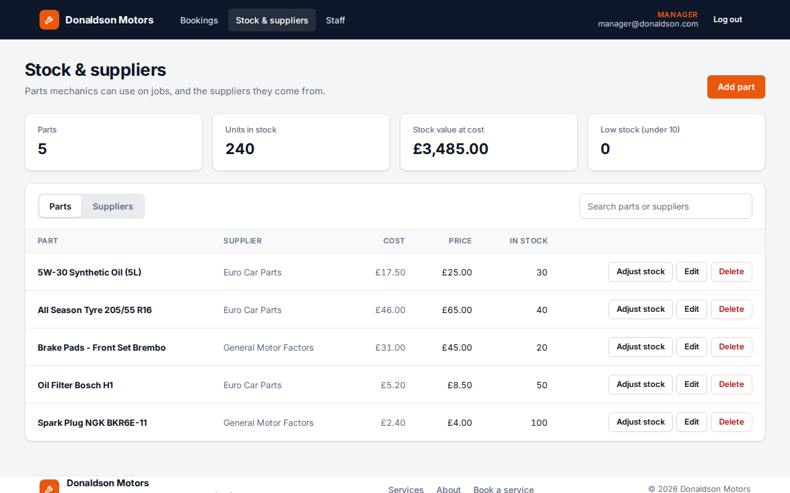
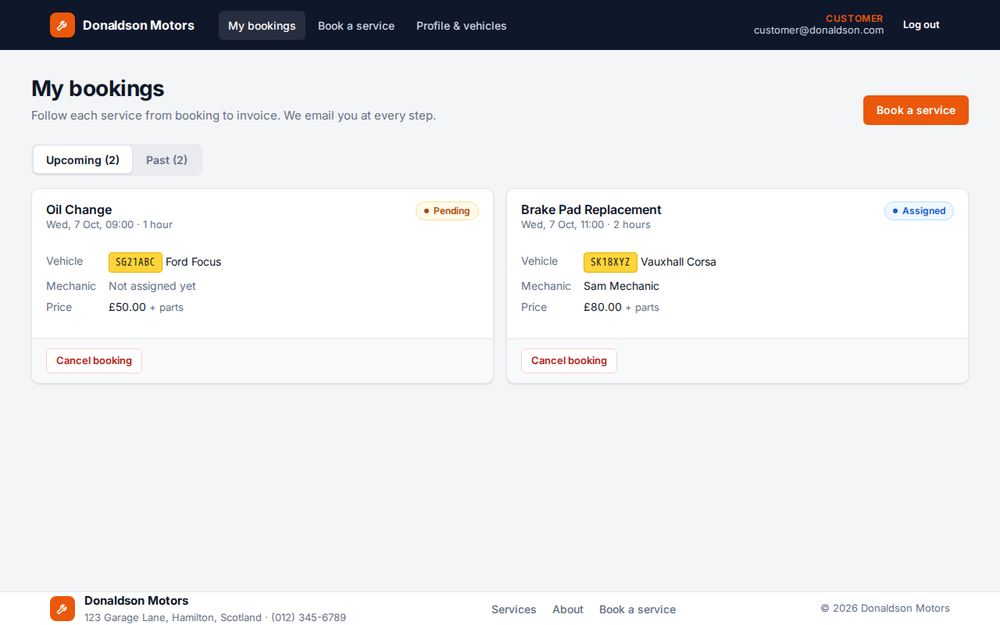

# Donaldson Motors

[](https://github.com/OlehDzhumyk/DonaldsonMotors/actions/workflows/ci.yml)

A booking and workshop system for a car garage, built as my final project for the HND in Software Development.
Customers book a service online; the manager assigns a mechanic; the mechanic records the work and the parts used;
the accounts clerk takes payment. Customers get an email at each step, ending with an itemised invoice.

**Stack:** ASP.NET Core Web API (.NET 10), EF Core + PostgreSQL, ASP.NET Core Identity with JWT,
React 19 + TypeScript + Redux Toolkit, Docker Compose, xUnit + Moq + Testcontainers, Vitest.

<table>
  <tr>
    <td></td>
    <td></td>
  </tr>
  <tr>
    <td align="center">Customer: booking a service</td>
    <td align="center">Manager: bookings by status</td>
  </tr>
  <tr>
    <td></td>
    <td></td>
  </tr>
  <tr>
    <td align="center">Manager: assigning a mechanic who is free</td>
    <td align="center">Mechanic: finishing a job and sending the invoice</td>
  </tr>
  <tr>
    <td></td>
    <td></td>
  </tr>
  <tr>
    <td align="center">Stock controller: parts and suppliers</td>
    <td align="center">Customer: upcoming bookings</td>
  </tr>
</table>

## Features

- **Five roles** with JWT authentication: Customer, Manager, Mechanic, Stock Controller and Accounts Clerk.
  Each role gets its own pages, and the API checks the role on every endpoint.
- **Booking.** Customers add their cars, pick a service and choose a free slot. Slots come from the garage's
  working hours, lunch break and holidays, which the manager can change. A slot that is already booked is not offered.
  Times are UK local time, so they stay at 09:00 through BST and GMT.
- **Booking life cycle:** Pending → Assigned → In progress → Awaiting payment → Paid, or Cancelled.
  The service enforces each step: only the assigned mechanic can start or finish a job, and a manager can only assign
  a mechanic who has no overlapping job.
- **Jobs and stock.** When mechanics finish a job, they record the work, the labour cost and the parts used.
  The parts come out of stock, and stock can't go below zero.
- **Emails** for each step: welcome, booking confirmed, mechanic assigned, job done (with the amount due),
  paid invoice and cancellation. They are rendered from Razor templates and sent in the background, so a slow mail
  server doesn't slow down the app. In Docker they go to [Mailpit](https://mailpit.axllent.org/), so you can read
  them at http://localhost:8025.
- **Layered API:** controllers → services → repositories with a unit of work, DTOs and mappers. Errors come back
  as ProblemDetails from a single exception handler. The database blocks double bookings and lost stock updates when
  two requests race. There are 43 endpoints and a [Bruno](https://www.usebruno.com/) collection of 55 example
  requests. Swagger UI is at http://localhost:5080/swagger.

## Running it

You need Docker. This starts the React app, the API, PostgreSQL and Mailpit. The API applies the migrations and
seeds demo data on first start:

```bash
git clone https://github.com/OlehDzhumyk/DonaldsonMotors.git
cd DonaldsonMotors
docker compose up --build
```

| What              | Where                          |
|-------------------|--------------------------------|
| Web app           | http://localhost:3000          |
| API and Swagger   | http://localhost:5080/swagger  |
| Emails (Mailpit)  | http://localhost:8025          |

No `.env` file is needed. To change a setting, such as using a real SMTP server, copy [`.env.example`](.env.example) to `.env`.

### Demo accounts

All demo accounts use the password `Password123!`. The login page also lists them, and clicking one fills in the form.

| Role             | Email                    |
|------------------|--------------------------|
| Customer         | customer@donaldson.com   |
| Manager          | manager@donaldson.com    |
| Mechanic         | mechanic@donaldson.com   |
| Stock controller | stock@donaldson.com      |
| Accounts clerk   | accounts@donaldson.com   |

The demo data has a booking in every state, including finished jobs with parts, invoices and payments.

### Running from source and more detail

- [**backend/README.md**](backend/README.md): running the API with `dotnet run`, configuration, migrations,
  how the code is laid out and why, and the backend tests.
- [**frontend/README.md**](frontend/README.md): running the app with Vite, scripts, auth and routing, and the
  frontend tests.

## Tests

```bash
cd backend/DonaldsonMotors && dotnet test     # needs Docker for the integration tests
cd frontend && npm test
```

- **80 backend tests.** There are 37 unit tests (xUnit + Moq) of the booking, schedule and email rules. There are
  also 43 integration tests that run the real API against PostgreSQL in [Testcontainers](https://dotnet.testcontainers.org/),
  including a booking going from Pending to Paid across four roles. Line coverage is about 85%.
- **17 frontend tests** (Vitest + Testing Library).

GitHub Actions runs the backend build (with warnings treated as errors), both test suites, the frontend type check,
lint and build, and the Docker image builds.

## What I'd do next

- Online payment (for example Stripe Checkout) in place of the clerk marking the job as paid.
- Size slots by the service. Today every slot is two hours, even for a 30-minute tyre change, and the garage takes
  one booking per slot whatever the number of mechanics.
- Refresh tokens. At the moment the user is logged out when the 60-minute JWT expires.
- An email for each invoice in PDF form, and a page where customers can download their past invoices.

## Licence

[MIT](LICENSE)
